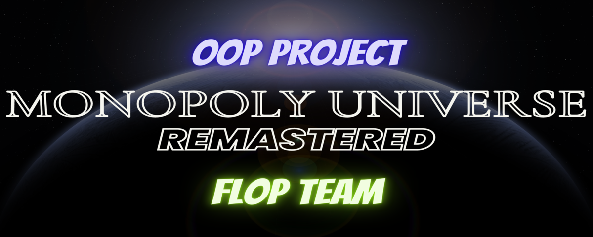

<div id="top" align="center">

</div>
<!-- PROJECT LOGO -->
<div align="center">
<h1 align="center">MONOPOLY UNIVERSE</h1>
  <h3 align="center">
    Classic MONOPOLY. Remastered for OOP Course at International University - VNU
    <br />
    <br />
    <a href="https://github.com/haingocnguyen/Monopoly-FlopTeam/issues">Report Bug</a>
    ·
    <a href="https://github.com/haingocnguyen/Monopoly-FlopTeam/issues">Request Feature</a>
  </h3>

[![Contributors][contributors-shield]][contributors-url]
[![Forks][forks-shield]][forks-url]
[![Issues][issues-shield]][issues-url]

</div>

<!-- About -->
# ABOUT
## 1. The team behind it (FLOP TEAM Members)

| No.|       Full Name       |Student's ID |            Email                 |              Roles              |        Contribution    |
|:--:| :-------------------: | :---------: | :------------------------------: | :-----------------------------: | :--------------------: |
|  1 | Nguyen Tran Trung Quan| ITITUN21003 | ITITUN21003@student.hcmiu.edu.vn |           TEAM LEADER           |           30%          |
|  2 |  Nguyen Hoang Anh Tu  | ITDSIU20090 | ITDSIU20090@student.hcmiu.edu.vn | CARD AND BOARD CONTENT CREATOR  |           25%          |
|  3 |   Nguyen Quang Dieu   | ITDSIU20031 | ITDSIU20031@student.hcmiu.edu.vn | RULES AND PROPERTIES MANAGEMENT |           15%          |
|  4 |    Hoang Tuan Kiet    | ITDSIU21059 | ITDSIU21059@student.hcmiu.edu.vn |         RENTING AND REPORT      |           15%          |
|  5 |    Nguyen Hai Ngoc    | ITDSIU21057 | ITDSIU21057@student.hcmiu.edu.vn |         DESIGN AND SLIDE        |           15%          |


## 2. The project we are working on

[![Product Name Screen Shot][product-screenshot]]("Resources/screenshot.png")


<!-- REASON -->
# REASON
## 1. Idea

## 2. Roadmap
- [X] Feature 1
- [ ] Feature 2
- [ ] Feature 3
- [ ] Nested Feature

See the [open issues](https://github.com/haingocnguyen/Monopoly-FlopTeam/issues) for a full list of proposed features (and known issues).


<!-- METHODOLOGY -->
# METHODOLOGY
## 1. Rules


## 2. Design
### a. The UI/UX

### b. The game logic

## 3. UML Diagram

[![UML DIagram][uml-diagram]]("Resources/UML.png")

<!-- RESULT -->
# DEMO - RESULT

[![Demo1][demo1]]("Resources/demo1.png")

[![Demo2][demo2]]("Resources/demo2.png")

[![Demo3][demo3]]("Resources/demo3.png")

[![Demo4][demo4]]("Resources/demo4.png")


<!-- INSTALLATION -->
# INSTALLATION
### Required software

* Java Development Kit (i.e. OpenJDK) [CLICK TO DOWNLOAD]()
* Any Java IDE (i.e. JetBrains Intellij IDEA) [CLICK TO DOWNLOAD]()

### Steps

1. Clone the repo
   ```sh
   git clone https://github.com/haingocnguyen/Monopoly-FlopTeam.git
   ```
2. Open in a Java IDE
3. Choose Monopoly.java and click RUN to play the game


<!-- CONTRIBUTING -->
# CONTRIBUTING

Contributions are what make the open source community such an amazing place to learn, inspire, and create. Any contributions you make are **greatly appreciated**.

If you have a suggestion that would make this better, please fork the repo and create a pull request. You can also simply open an issue with the tag "enhancement".
Don't forget to give the project a star! Thanks again!

1. Fork the Project
2. Create your Feature Branch (`git checkout -b feature/AmazingFeature`)
3. Commit your Changes (`git commit -m 'Add some AmazingFeature'`)
4. Push to the Branch (`git push origin feature/AmazingFeature`)
5. Open a Pull Request


<!-- LICENSE -->
# LICENSE

Distributed under the MIT License. See `LICENSE.txt` for more information.


<!-- CONTACT -->
# CONTACT

Nguyen Tran Trung Quan by  **[Email HERE](ITITUN21003@student.hcmiu.edu.vn)**

Project Link: [https://github.com/haingocnguyen/Monopoly-FlopTeam](https://github.com/haingocnguyen/Monopoly-FlopTeam)

<!-- ACKNOWLEDGMENTS -->
# ACKNOWLEDGEMENTS

* []() Prof. Nguyen Thanh Tung an Pham Quoc Son Lam 
* []() Original game code was adapted from


<!-- MARKDOWN LINKS & IMAGES -->
[contributors-shield]: https://img.shields.io/github/contributors/haingocnguyen/Monopoly-FlopTeam.svg?style=for-the-badge
[contributors-url]: https://github.com/haingocnguyen/Monopoly-FlopTeam/graphs/contributors
[forks-shield]: https://img.shields.io/github/forks/haingocnguyen/Monopoly-FlopTeam.svg?style=for-the-badge
[forks-url]: https://github.com/haingocnguyen/Monopoly-FlopTeam/network/members
[issues-shield]: https://img.shields.io/github/issues/haingocnguyen/Monopoly-FlopTeam.svg?style=for-the-badge
[issues-url]: https://github.com/haingocnguyen/Monopoly-FlopTeam/issues
[product-screenshot]: Resources/screenshot.png
[uml-diagram]: Resources/UML.png
[demo1]: Resources/demo1.png
[demo2]: Resources/demo2.png
[demo3]: Resources/demo3.png
[demo4]: Resources/demo4.png

