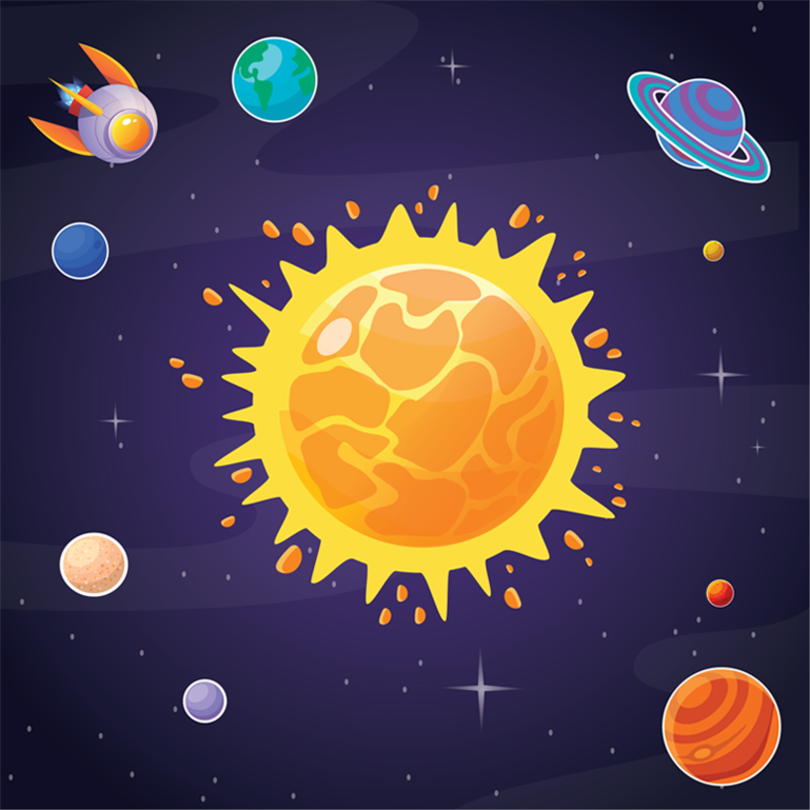
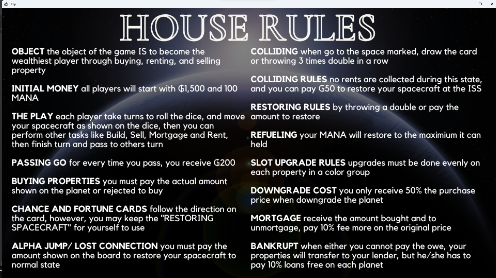
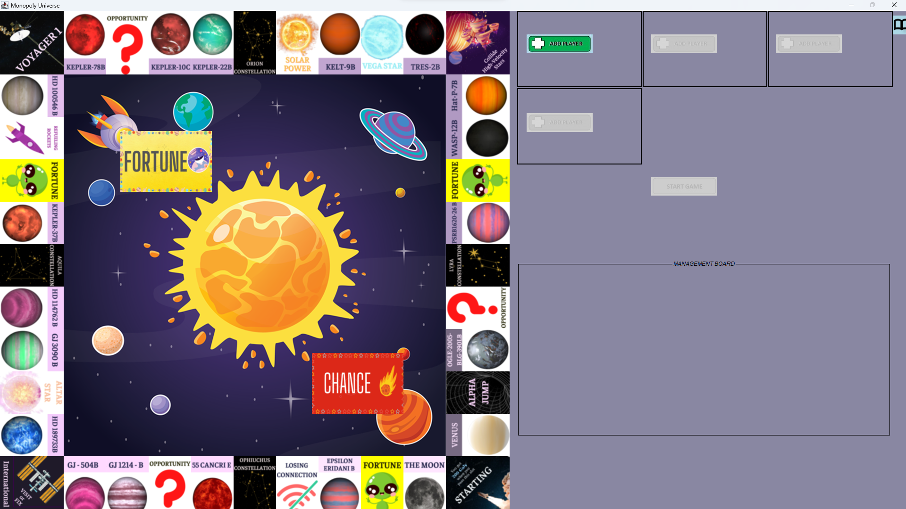
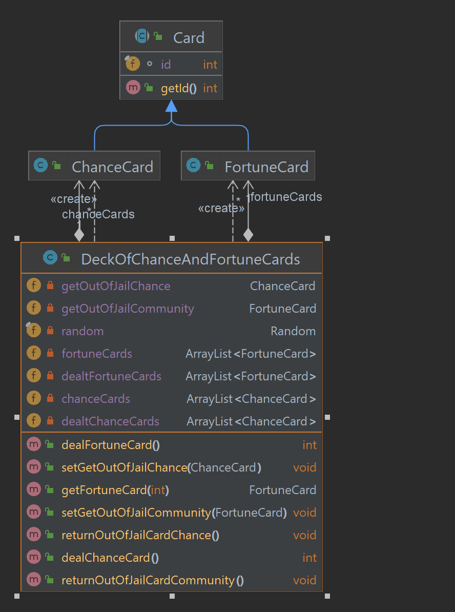
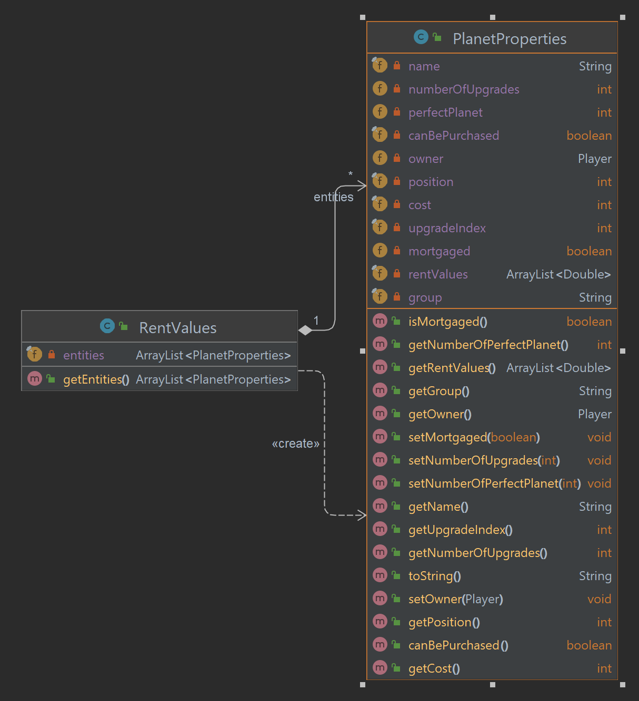
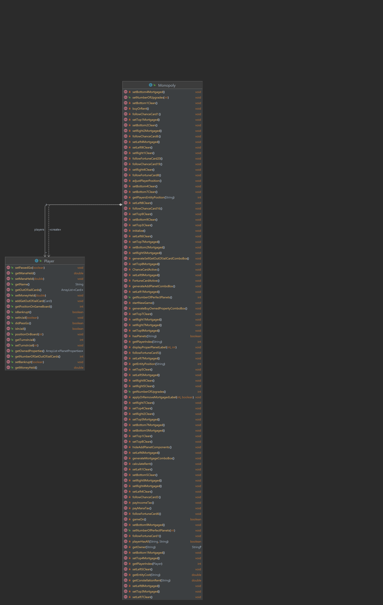
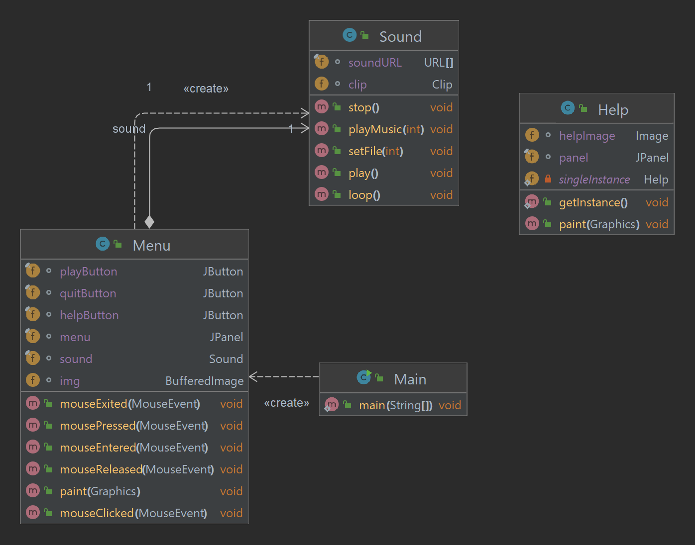
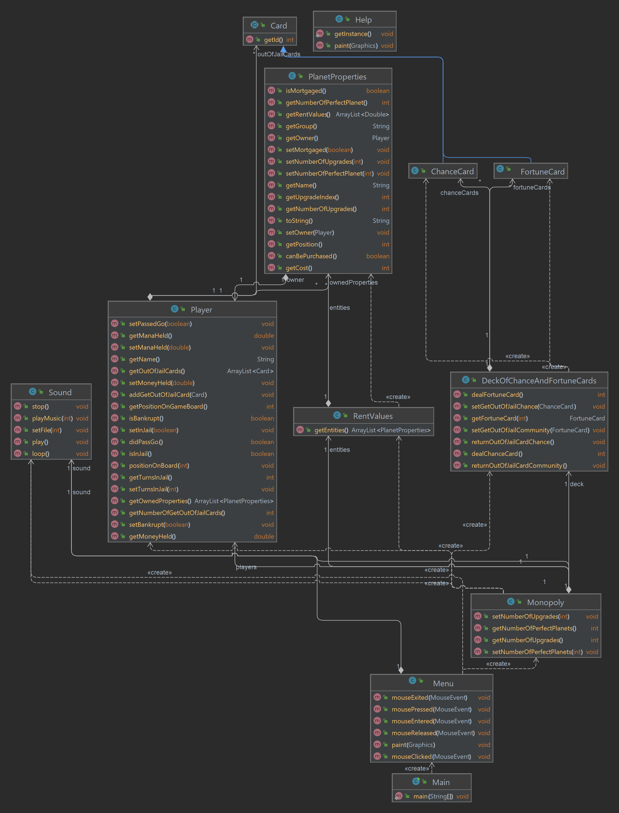
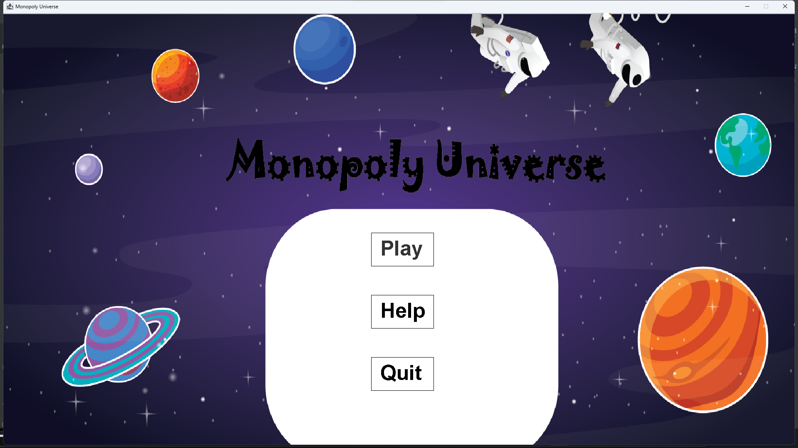
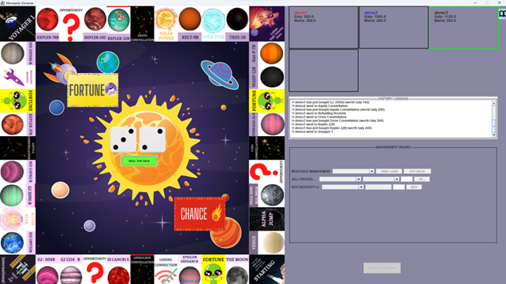

<div id="top" align="center">

</div>
<!-- PROJECT LOGO -->
<div align="center">
<h1 align="center">MONOPOLY UNIVERSE</h1>
  <h3 align="center">
    Classic MONOPOLY. Remastered for OOP Course at International University - VNU
    <br />
    <br />
    <a href="https://github.com/haingocnguyen/Monopoly-FlopTeam/issues">Report Bug</a>
    ·
    <a href="https://github.com/haingocnguyen/Monopoly-FlopTeam/issues">Request Feature</a>
  </h3>

[![Contributors][contributors-shield]][contributors-url]
[![Forks][forks-shield]][forks-url]
[![Issues][issues-shield]][issues-url]

</div>

<!-- About -->

# ABOUT

## 1. The team behind it (FLOP TEAM Members)

| No.| Full Name |Student's ID | Email | Roles | Contribution |
|:--:| :-------------------: | :---------: | :------------------------------: | :-----------------------------: | :--------------------: |
| 1 | Nguyen Tran Trung Quan| ITITUN21003 | ITITUN21003@student.hcmiu.edu.vn | TEAM LEADER | 30% |
| 2 | Nguyen Hoang Anh Tu | ITDSIU20090 | ITDSIU20090@student.hcmiu.edu.vn | CARD AND BOARD CONTENT CREATOR | 25% |
| 3 | Nguyen Quang Dieu | ITDSIU20031 | ITDSIU20031@student.hcmiu.edu.vn | RULES AND PROPERTIES MANAGEMENT | 15% |
| 4 | Hoang Tuan Kiet | ITDSIU21055 | ITDSIU21059@student.hcmiu.edu.vn | DESIGN AND SLIDE | 15% |
| 5 | Nguyen Hai Ngoc | ITDSIU21057 | ITDSIU21057@student.hcmiu.edu.vn | RENTING AND REPORT | 15% |

## 2. The project we are working on
The board game **Monopoly**, which the Hasbro firm produces, was adapted in 1993 from Lizzie Magie's The Landlord's Game. 
The game involves players moving around the game board while purchasing and trading homes or hotels to enhance their individual properties.

The project's goal is to create a fully playable game based on galactic conceptions and the fundamental concept of the first Monopoly game. 
The game can also demonstrate the four qualities of **object-oriented programming (OOP)** and the fundamentals of design patterns. 
To further enhance the game, commitments from others may also be acceptable.

To be short, the project aims to:

* []()	Create a game that is redesigned to entertain and educate players.

* []()	Practicing OOP techniques in the Theory class.

* []()  Go through the process of game management and code refining.

* []()  Evaluate the ability to build more features on top of the basic code.



<!-- REASON -->

# REASON

## 1. Idea
In this undertaking, the FLOP team created the game Monopoly Universe to provide players with a modernized version of Monopoly. 
The game's theme is recreated based on the idea of the galaxy and outer space. 

Along with the new idea, the Hasbro fundamental rules are still present, but the game rules have been altered to correspond with the local games played in Vietnam. 
By presenting details on many planets in the universe and outer space, the game also aids players in expanding their understanding of astronomy. 
This is the product of the effort to provide players, usually young pupils, with a game that is both entertaining and educational.


## 2. Roadmap

- [X] Game runs with minimum viable product
- [ ] Trading features
- [ ] Special roles for dice
- [ ] PvP to gain advantages

Please see the [open issues](https://github.com/haingocnguyen/Monopoly-FlopTeam/issues) for a full list of proposed features (
and known issues).

<!-- METHODOLOGY -->

# METHODOLOGY

## 1. Rules
The team tried to adapt from the original game rules which can be found online at; here is the summary of the main points:

* []()	**OBJECT** of the game is to become the wealthiest player by buying, renting, and selling property.
* []()	**INITIAL MONEY** all players will start with ₲1,500 and 100 MANA.
* []()	**THE GAMEPLAY** each player turns to roll the dice and move their spacecraft as shown on the dice. Then you can perform other tasks like build, sell, mortgage and rent, finish turn and pass to others.
* []()	**PASSING STARTING POINT**, you receive ₲200 each time.
* []()  **BUYING PROPERTIES** you must pay the amount shown on the planet or be rejected to buy if the conditions are not met (i.e., not enough money, not available).
* []()	**CHANCE AND FORTUNE** CARDS follow the direction on the card; however, you may keep the "RESTORING SPACECRAFT CARD" for yourself.
* []()	**ALPHA JUMP/ LOST** CONNECTION you must pay the amount shown on the board to restore your spacecraft to a normal state.
* []()	**COLLIDING** when you go to the space marked, draw the card, or throw three times double in a row, you will be sent to the International Space Station.
* []()	**COLLIDING RULES** no rents are collected during this state, and you can pay ₲50 to restore your spacecraft at the ISS.
* []()	**RESTORING SPACECRAFT** by throwing a double, paying the ₲50, or using "RESTORING SPACECRAFT CARD" to restore.
* []()	**REFUELING** your MANA will restore it to the maximum it can hold.
* []()	**PLANET UPGRADE** must be done evenly on each property in a color group.
* []()	**DOWNGRADE COST** you only receive 50% of the purchase price when downgrading the specified planet.
* []()	**MORTGAGE PLANET** to receive the amount bought and to unmortgage, pay a 10% fee from the original price.
* []()	**DECLARE BANKRUPT** when you cannot pay the fee, your properties will transfer to your lender, but he/she must pay 10% free loans on each planet.



## 2. Design

### a. The UI/UX
UI/UX has always been our first concern before playing the game, so we must think much of inspiration from others and produce our layout. 

With a twist from the Universe theme, we focused on changing three things: the avenue is replaced by a planer, the introduction of the ₲aly and MANA system, and utterly new galaxy-exclusive content. 

In specific, each component we have redesigned includes the following:
* []()	Planet cards
* []()	Chance and Fortune cards
* []()	Board of the game
* []()	Game's Welcome screen
* []()	Player' token
* []()	Dice
Putting them together with some parts taken online:
* []()	Sound 
* []()	Buttons

The results look like this:



In addition, the UX of the game was also our big concern since we have little knowledge about it, but we managed to do it for user actions like:
    Only playable at 1920x1080 resolution
* []()	Menu and Help screen
* []()	Buying properties
* []()	Paying rent
* []()	Buy/Sell/Mortgage
* []()	Roll the dice
* []()	The ability to show which planet that player owned using color bars
As we have tried our best, some game functions are not running smoothly as we expected them to, but we will be doing more research to better provide the UI/UX of this game in the future.

### b. The game logic
After a tremendous amount of time of repeating code and debugging, we have the final project structure like the image below:

We can group our classes into a specific group, such as:
* []()	Card: which contains parent class Card, its subclass ChanceCard, FortuneCard to extends, and DeckOfChanceAndFortuneCards to hold the information of the cards.
* []()	Planet: contains PlanetProperties and RentValues classes to hold the planet's information.
* []()	Player: contains Player and Monopoly classes to keep the player info and initialize the game. 
* []()	Main: contains Sound, Main, Help, and Menu to deal with game windows for the user to interact.

## 3. UML Diagram
To be more specific, we will dig into the group and to better visualize the structure and algorithms, we included the UML diagrams for the whole project and each group mentioned. :
* []()	Card
- [X]	We use ArrayList to store the information of each card.
- [X]	A method of dealtCard() uses a Random class to arbitrarily choose a specific card from the deck for the player to deal with.
- [X]	Combine with the getCard() method to give the main game which card it needs to work with.



* []()	Planet
- [X]	To begin, PlanetProperties has many attributes to keep the planet's properties, like the name, color group, owner, mortgage, and availability status, to catch up with the game.
- [X]	Inside RentValue is the ArrayList of entities where we initialize all the planets inside it using the constructor.




* []()	Player
- [X]	The same goes with Planet; inside Player, we also create a list of attributes specified to that Player and have the methods to get their info and control the flow of the game.
- [X]	The Monopoly class is an all-in-one place for the game to create with the help of JFrame libraries and Java Swing components
- [X]	It also holds the control logic of the game for features like the upgrade, creation player, and management board.
  


* []()	Main
- [X]	The primary method of this game initializes a screen that gets an instance of the Menu class
- [X]	Inside the Menu class is where the mouse clicks on each section: Play, Help, and Quit with their respective class to invoke.
  - 	Play: create a new object of Monopoly and play sound
  - 	Help: get an instance of the Help object using the singleton design pattern 
  - 	Quit: exit the Menu object and terminates the program
- [X]	Sound class is added to provide the game with sound for more fun and joy, which has the method of looping(), playing(), and stopping() the music itself.
 


Better view of UML for whole project



<!-- INSTALLATION -->

# INSTALLATION

### Required software

* Java Development Kit (i.e. OpenJDK) [CLICK TO DOWNLOAD]()
* Any Java IDE (i.e. JetBrains Intellij IDEA) [CLICK TO DOWNLOAD]()

### Steps

1. Clone the repo
   ```sh
   git clone https://github.com/haingocnguyen/Monopoly-FlopTeam.git
   ```
2. Open in a Java IDE
3. Choose Monopoly.java and click RUN to play the game

<!-- RESULT -->

# DEMO - RESULT
Sample of the game screenshots that demo the game's current build:

- [X]	The menu when running game



- [X]	Help screen


- [X]	Game start


- [X]	Game playing




<!-- CONTRIBUTING -->

# CONTRIBUTING

Contributions are what make the open source community such an amazing place to learn, inspire, and create. Any
contributions you make are **greatly appreciated**.

If you have a suggestion that would make this better, please fork the repo and create a pull request. You can also
simply open an issue with the tag "enhancement".
Don't forget to give the project a star! Thanks again!

1. Fork the Project
2. Create your Feature Branch (`git checkout -b feature/AmazingFeature`)
3. Commit your Changes (`git commit -m 'Add some AmazingFeature'`)
4. Push to the Branch (`git push origin feature/AmazingFeature`)
5. Open a Pull Request

<!-- CONTACT -->

# CONTACT

Nguyen Tran Trung Quan by  **[Email HERE](ITITUN21003@student.hcmiu.edu.vn)**

Project Link: [https://github.com/haingocnguyen/Monopoly-FlopTeam](https://github.com/haingocnguyen/Monopoly-FlopTeam)

<!-- ACKNOWLEDGMENTS -->

# ACKNOWLEDGEMENTS

We want to express our sincerest thanks to our lecturer and the people who have helped us to achieve this project's goals:
- []()	Dr. Tran Thanh Tung
- []()	M.Sc. Pham Quoc Son Lam
- []()	Original code from **[pawelpaszki](https://github.com/pawelpaszki/monopoly)**
- []()	The sites [Geeksforgeeks](https://www.geeksforgeeks.org/), [Javapoints](https://www.javatpoint.com/java-swing), and so on
- []()	The README.md template from **[othneildrew](https://github.com/othneildrew/Best-README-Template)**

<!-- MARKDOWN LINKS & IMAGES -->

[contributors-shield]: https://img.shields.io/github/contributors/haingocnguyen/Monopoly-FlopTeam.svg?style=for-the-badge

[contributors-url]: https://github.com/haingocnguyen/Monopoly-FlopTeam/graphs/contributors

[forks-shield]: https://img.shields.io/github/forks/haingocnguyen/Monopoly-FlopTeam.svg?style=for-the-badge

[forks-url]: https://github.com/haingocnguyen/Monopoly-FlopTeam/network/members

[issues-shield]: https://img.shields.io/github/issues/haingocnguyen/Monopoly-FlopTeam.svg?style=for-the-badge

[issues-url]: https://github.com/haingocnguyen/Monopoly-FlopTeam/issues


